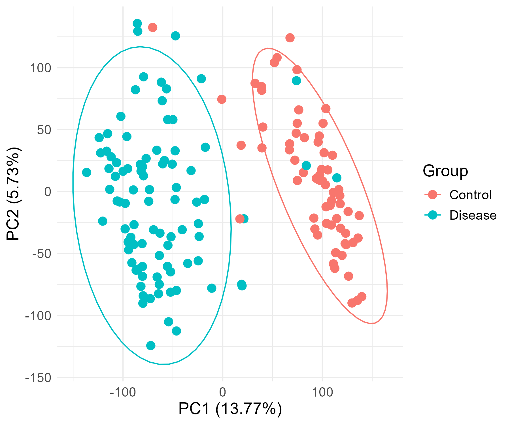
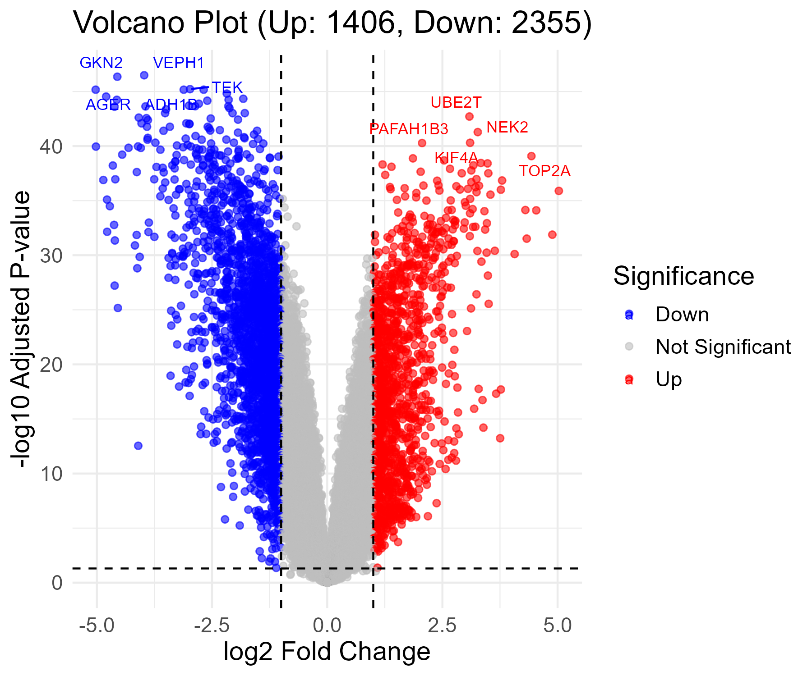
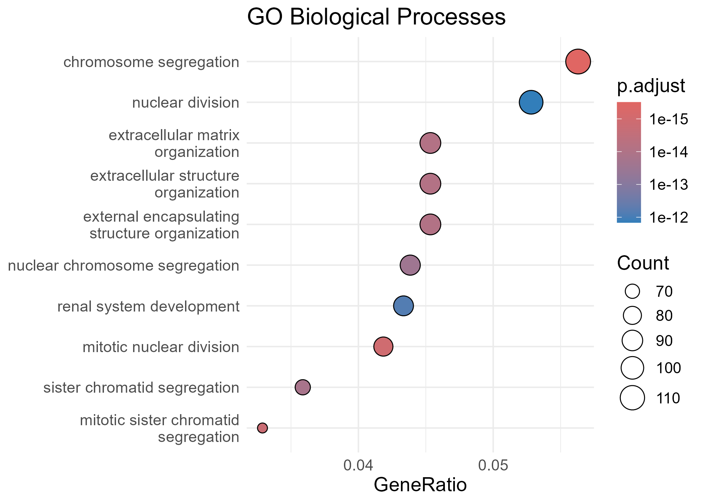
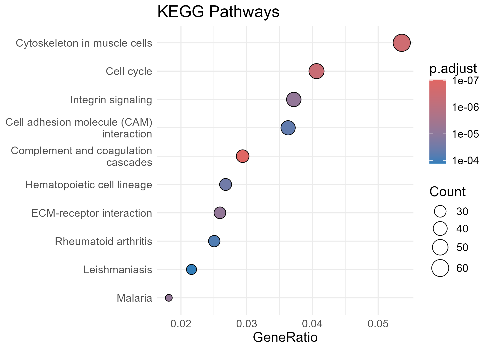

# Transcriptomics Analysis Pipeline

> End-to-end transcriptomic analysis pipeline for microarray and RNA-seq data, integrating differential expression, functional enrichment, and biological interpretation.

**Demonstrated on GEO dataset GSE19188 with clear disease vs control separation and biologically meaningful pathway enrichment.**

## Overview

This repository contains an end-to-end transcriptomic analysis pipeline for gene expression data, supporting both microarray and RNA-seq datasets. The workflow includes differential expression analysis, gene annotation, visualization, and functional enrichment.
The pipeline is designed to be reusable across datasets, enabling rapid differential expression analysis and downstream biological interpretation.

---

## Key Findings (Microarray: GSE19188)
- Analyzed microarray dataset GSE19188 to identify disease-associated transcriptomic changes  
- Identified **1406 upregulated** and **2355 downregulated genes** (FDR < 0.05, |logFC| > 1)  
- PCA shows **clear separation between control and disease samples**, indicating strong transcriptomic differences  
- Differential expression highlights key genes such as **TOP2A, NEK2, UBE2T, KIF4A**, associated with cell proliferation and mitotic regulation
- Full differential expression and enrichment results are provided below

<details>
<summary><b>View full result tables (DE, GO, KEGG)</b></summary>

- Differential expression results: [DE genes](results/tables/DE_genes.csv)
- GO enrichment results: [GO results](results/tables/GO_results.csv)
- KEGG enrichment results: [KEGG results](results/tables/KEGG_results.csv)

</details>

### Enriched Biological Processes (GO)
- Chromosome segregation  
- Nuclear division  
- Mitotic sister chromatid segregation  
- Extracellular matrix organization  

### Enriched Pathways (KEGG)
- Cell cycle  
- Integrin signaling  
- ECM-receptor interaction  
- Complement and coagulation cascades  

### Biological Interpretation
The enrichment of **cell cycle and chromosome segregation pathways** suggests increased proliferative activity in disease samples, while **ECM and integrin signaling pathways** indicate alterations in cell adhesion and microenvironment interactions. Together, these results point toward a combination of **uncontrolled cell division and extracellular remodeling**, which are characteristic of disease progression.

## Key Visualizations

### PCA Plot (PC1: 13.77%, PC2: 5.73%)


### Volcano Plot


<details>
<summary><b>View Functional Enrichment Plots</b></summary>




</details>

## Pipelines

### 1. LIMMA Pipeline (Microarray)

* Data retrieval from GEO
* Data preprocessing and normalization
* Quality control (PCA)
* Differential expression analysis using LIMMA
* Identification of significant genes (FDR < 0.05, |logFC| > 1)
* Probe-to-gene annotation
* Visualization:

  * PCA plot
  * Volcano plot
  * Heatmap
  * Sample clustering
* Functional enrichment:

  * Gene Ontology (GO)
  * KEGG pathways

---

### 2. DESeq2 Pipeline (RNA-seq)

* Framework implemented for RNA-seq analysis using DESeq2
* Includes normalization, differential expression, and downstream visualization
* Designed to support RNA-seq datasets; extension to additional datasets is straightforward.

---

## Dataset

* GEO Accession: GSE19188 (microarray)
* Source: [GSE19188 on GEO, NCBI](https://www.ncbi.nlm.nih.gov/geo/query/acc.cgi?acc=GSE19188)
* Associated publication: Hou J, Aerts J, den Hamer B, et al. Gene expression-based classification of non-small cell lung carcinomas and survival prediction. *PLoS One*. 2010;5(4):e10312. https://doi.org/10.1371/journal.pone.0010312

---

## Project Structure

```
scripts/   → analysis pipelines  
results/   → output files (CSV, plots)  
```

---

## How to Run

1. Install required R packages (see Installation section)
2. Run `scripts/limma_pipeline.Rmd`
3. Results will be generated in the `results/` directory


## Installation

Tested on R (>= 4.2)

### Install CRAN packages
```r
install.packages(c("ggplot2", "pheatmap"))
```
### Install Bioconductor packages
```r
if (!requireNamespace("BiocManager", quietly = TRUE))
    install.packages("BiocManager")

BiocManager::install(c(
    "limma",
    "DESeq2",
    "GEOquery",
    "clusterProfiler",
    "org.Hs.eg.db"
))
```
## Tools Used

* R
* limma
* DESeq2
* GEOquery
* clusterProfiler
* org.Hs.eg.db
* ggplot2
* pheatmap

---

## Reproducibility
R version: >= 4.2  
Key packages: limma, DESeq2, clusterProfiler

## Notes

* Gene-level expression is derived from probe-level data by selecting the most significant probe per gene.
* Statistical significance is determined using adjusted p-values (FDR).

---

## Author

Gideon Samuel
